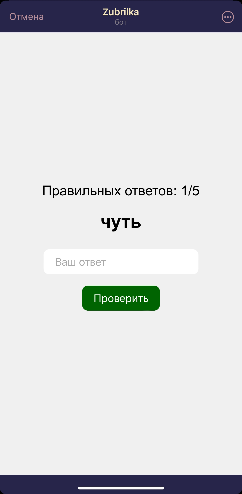
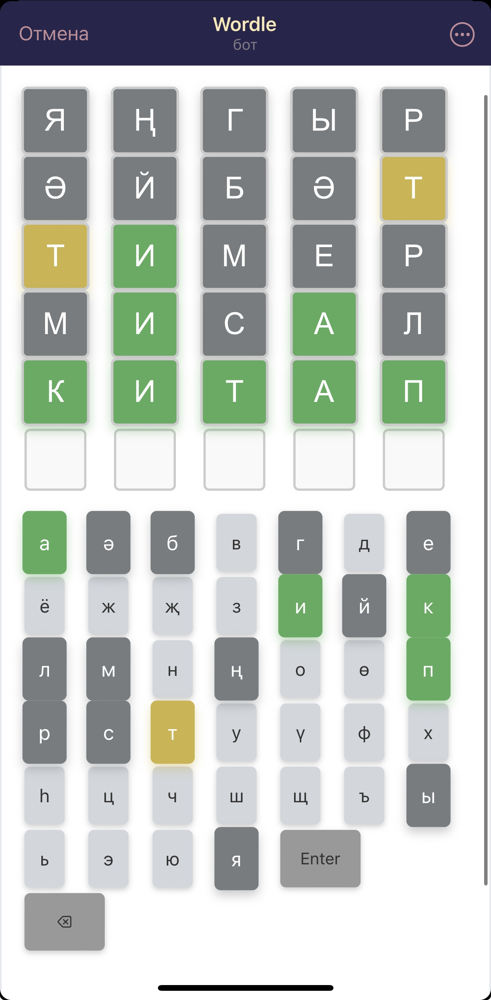
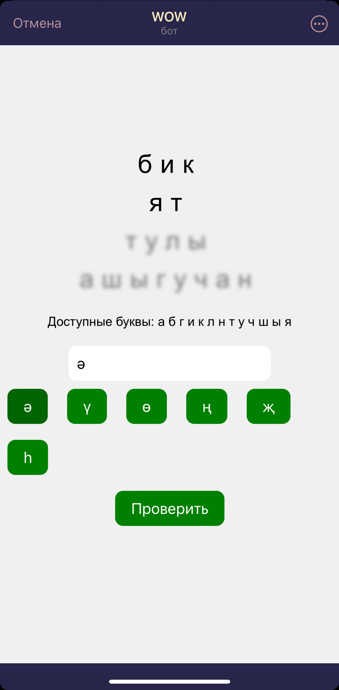

# TatarLanguageLab
### Добро пожаловать! Это проект TatarLanguageLab для Татар.Бу хакатона 2024
Наш проект - телеграм бот, помогающий изучать татарский язык и культуру

  Ссылка на бота: `https://t.me/TatarLanguageLabBot`  
---
## Преимущества по сравнению с аналогами
1. Несколько игр в одном боте
2. Присутствует сюжетная линия
3. и т.д.
---
## Примеры использования
### Стартовое меню

### Меню мини-игр

  
 
### Интерфейс мини-игр

### Интерфейс сюжетной линии
